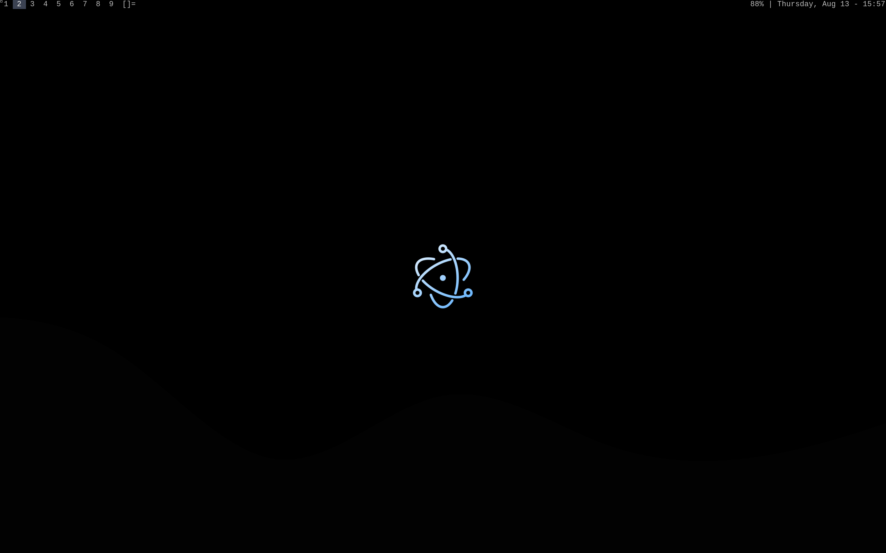

The stuff ill be using in my gentoo installation 


## Preview



### Prerequisites
```
 - x11-base/xlibre-server
 - x11-apps/xrdb                   (OPTIONAL)
 - x11-apps/xsetroot
 - x11-apps/xrandr
 - x11-apps/xset

 - x11-libs/libX11
 - x11-libs/libXft
 - x11-libs/libXext

 - x11-misc/rofi
 - x11-misc/dunst
 - x11-misc/xclip

 - media-gfx/feh
 - media-gfx/flameshot

 - app-editors/neovim
 - sys-apps/ripgrep
```

#### GURU Overlay
```
 - media-fonts/nerdfonts victormono
 - app-misc/brightnessctl          (OPTIONAL)
```

### Steps
```
git clone https://github.com/RoopakShukla/GentooConfig && cd GentooConfig
chmod +x move.sh 
./move.sh
```

#### Patches
- [systray](https://dwm.suckless.org/patches/systray/)

#### Credits
- st - github.com/siduck
- bfetch - github.com/Mjoyufull/bfetch
- NvChad - github.com/NvChad (also from siduck)
- .vim - tonybtw's tutorial on YouTube

.wallpapers from:
- github.com/octagony/dwm-config-files
- wallhaven

