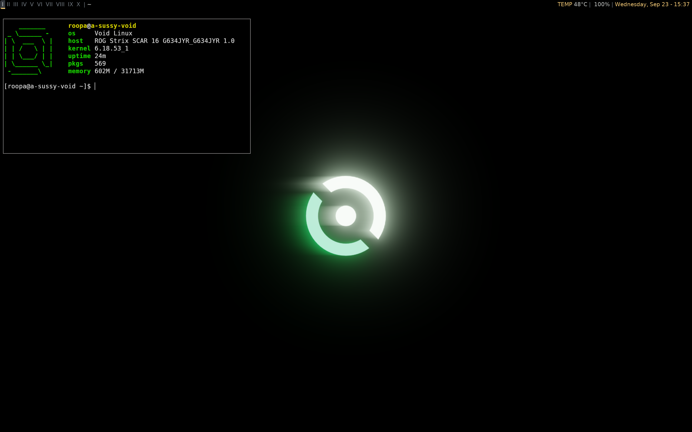
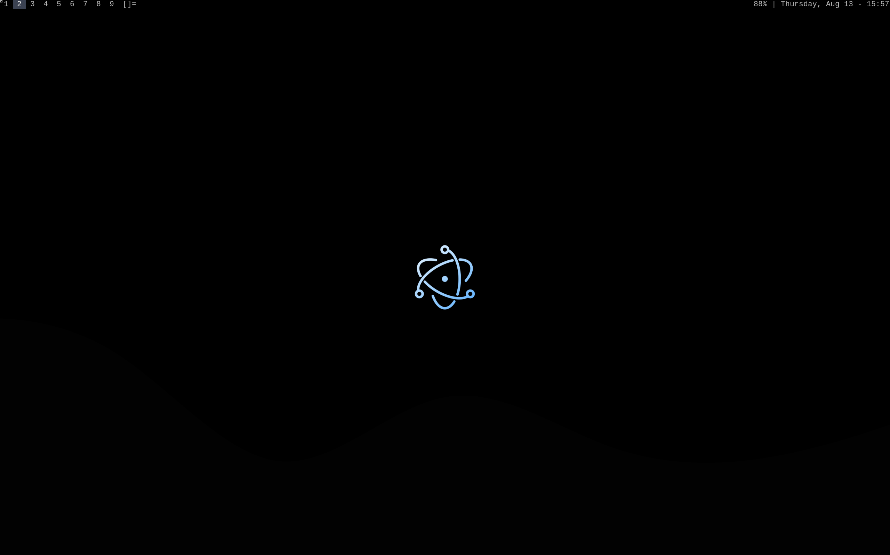

The stuff ill be using in any linux installation 


## Preview
### BSPWM


### DWM


### Prerequisites

<details>
<summary> Gentoo </summary>

```
 - x11-base/xlibre-server
 - x11-apps/xrdb             (OPTIONAL)           
 - x11-apps/xsetroot
 - x11-apps/xrandr
 - x11-apps/xset

 - x11-libs/libX11
 - x11-libs/libXft
 - x11-libs/libXext

 - x11-misc/rofi
 - x11-misc/dunst
 - x11-misc/xclip

 - media-gfx/feh
 - media-gfx/flameshot

 - app-editors/neovim
 - sys-apps/ripgrep

 - media-fonts/nerdfonts victormono
 - app-misc/brightnessctl   (OPTIONAL)
```

</details>

<details>
<summary> Void <3 </summary>

```
Will be updated soon.
```
</details>


#### Credits
- tmux - codeberg.org/theidioticdev/void-btw
- vis - https://git.symlinx.net/daccfiles

wallpapers from:
- github.com/octagony/dwm-config-files
- wallhaven

