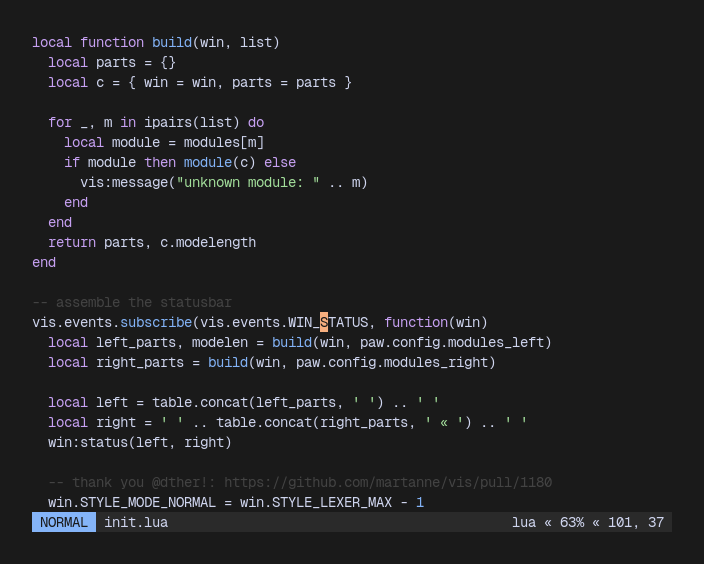

# vis-paw



paw is a statusbar plugin for `vis`, the primary goal of which is to be prettier than the default statusbar while still being as functional. it was written over the span of 2 evenings, as a product of boredom and experimentation. it is, however, quite neat (or atleast i want to think so)!

## configuration

paw allows customization of the mode styles and the modules displayed in the statusbar. the default configuration is as follows:

```lua
paw.config = {
  style_normal = 'fore:black,back:blue',
  style_visual = 'fore:black,back:yellow',
  style_insert = 'fore:black,back:green',
  style_replace = 'fore:black,back:magenta',

  separator_left = ' ',
  separator_right = ' « ',

  modules_left = {
    'mode',
    'file'
  },
  modules_right = {
    'flags',
    'syntax',
    'percent',
    'progress'
  }
}
```

the `style_*` keys are responsible for the styles of the mode strings (NORMAL, INSERT &c). the `modules_*` tables are responsible for the modules on the left-justified, and right-justified parts of the statusbar, respectively.

these options can be modified by the user in their vis configuration using the `paw.setup` function:

```lua
paw.setup({
  style_normal = 'fore:green,back:white',
  modules_right = { 'percent', 'syntax' }
})
```

you are welcome to tinker around with the source code or open an issue if you find any features that are missing!

## todo

- [ ] inactive statusbar configuration if possible
- [ ] configuration of the mode strings
- [ ] compare default statusbar and paw's overhead
